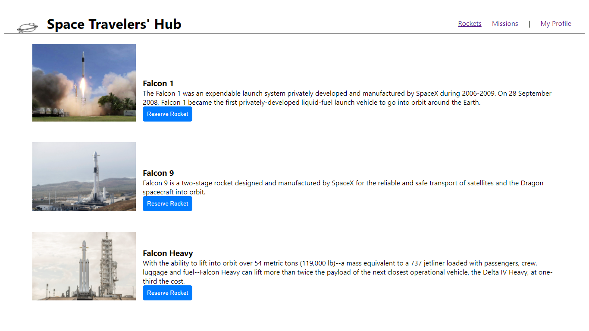
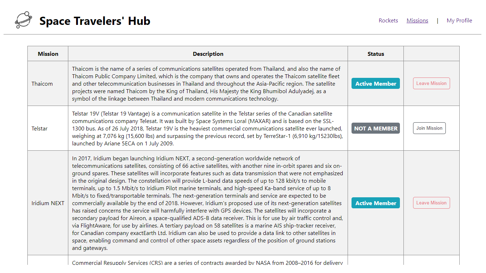
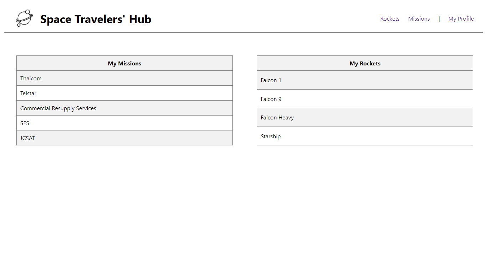

## SPACE TRAVELERS HUB 

> This is a capstone project, it is working with the real live data from the SpaceX API. It is a web application for a company that provides commercial and scientific space travel services. The application will allow users to book rockets and join selected space missions.

## ScreenShoot
### Rockets
 > 
   ### Missions
 >

### My profile
 >
## Built With

- HTML
- CSS 
- JavaScript 
- React
- Redux

## Live demo

[Netlify](https://vigorous-darwin-db6969.netlify.app/)

## Getting Started

To get a local copy up and running follow these simple example steps.

### Prerequisites

- Node and NPM
- Web browser (Google chrome)
- Code Editor (VSCode)

### Development (Running locally)

- git clone the project

```bash 
git clone git@github.com:akucintavalent/space-travelers-hub
```

- Install Dependencies

```bash
npm install
```

- To run StyleLint by itself, you may run the lint task:

```bash
npx stylelint "**/*.{css,scss}"
```

- Automatically fix issues found (where possible):

```bash
npx stylelint "**/*.{css,scss}" --fix
```
- To fix automatically javaScript issues found
```bash
npx eslint . --fix
```

- Finally, start your development server by running:

```bash
npm start
```

👤 **Bohdan Shcherbak**

- [GitHub](https://github.com/akucintavalent)
- [Twitter](https://twitter.com/ibodi828)
- [LinkedIn](https://www.linkedin.com/in/bohdan-shcherbak/)

👤 **Debas Gebreslasie**

- [GitHub](https://github.com/Debas-31)
- [Twitter](https://twitter.com/DEBSH76956492)
- [LinkedIn](https://www.linkedin.com/in/debas-gebrengus)

## 🤝 Contributing

Contributions, issues and feature requests are welcome!

Feel free to check the [issues page](https://github.com/akucintavalent/space-travelers-hub/issues).

## Show your support

Give a ⭐️ if you like this project!

## Acknowledgments

- React Community 
- Space Travelers Hub
- Microverse

## 📝 License

[MIT licensed](https://github.com/akucintavalent/space-travelers-hub/blob/styling/MIT.md).
